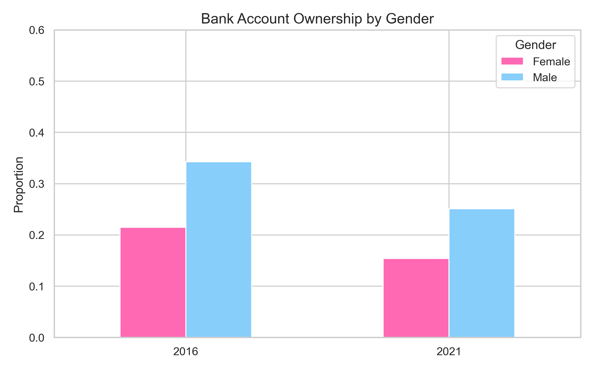
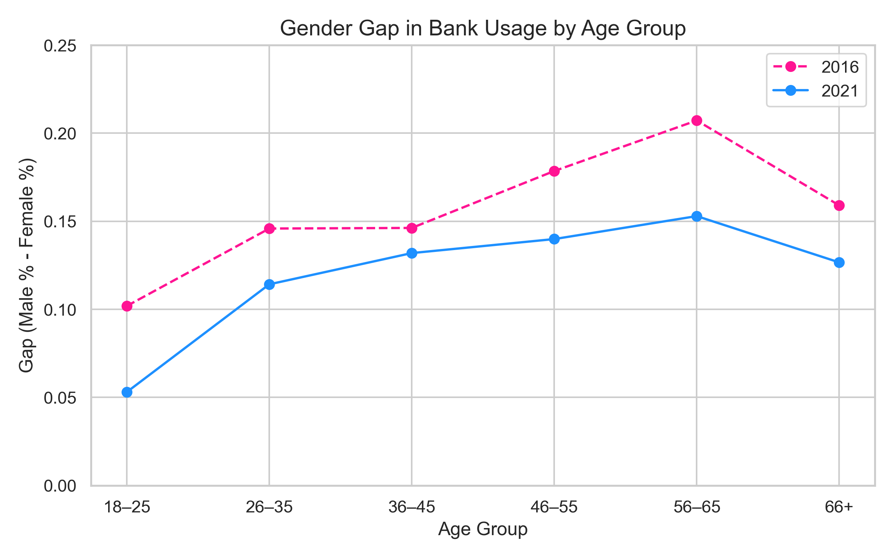
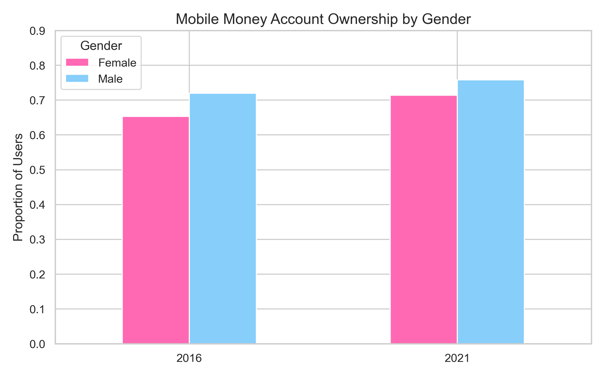
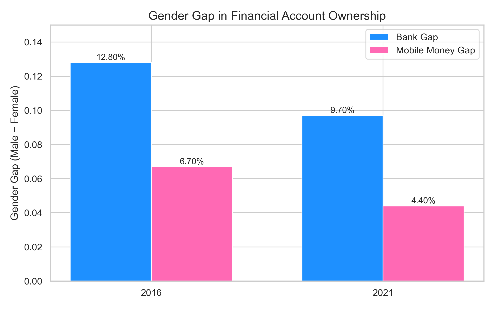
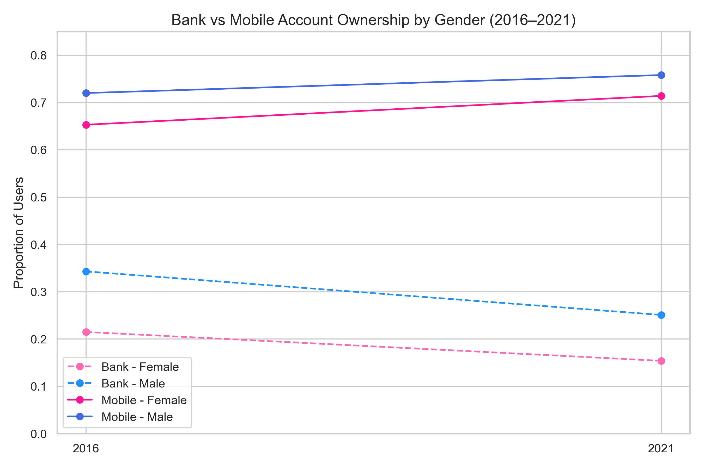

# Financial Inclusion Analysis (Kenya)

This project analyzes the gender gap in financial access in Kenya using the **FinAccess 2016 and 2021 datasets**.

## 🔍 Objectives
- Quantify the gender gap in **bank account ownership**
- Compare it with the gap in **mobile money usage**
- Track changes in usage across **2016–2021**
- Understand trends by **age** and **residence (rural/urban)**
- Identify key drivers behind shifts in financial access

## 📁 Folder Structure
- `data/` – cleaned CSVs of 2016 and 2021 data
- `charts/` – saved visuals from the analysis
- `notebooks/` – Jupyter notebooks for exploration & final report

## 📊 Key Findings
- 📉 **Bank account usage declined** for both men and women — more sharply for men  
- 📈 **Mobile money usage increased**, narrowing the overall gender gap  
- 👵 The gender gap persists **across all age groups** but is smaller among youth  
- 🏘️ Urban areas show **higher access**, but rural-urban gaps are closing  
- 💸 **Mobile accounts are more inclusive** than traditional bank accounts

##  Tech Used
- Python (Pandas, Matplotlib, Seaborn)
- Jupyter Notebook

## 📈 Visual Preview
---

## 📸 Full Visual Gallery

### 1️⃣ Bank Account Ownership by Gender

### 2️⃣ Gender Gap in Bank Usage by Age Group

### 3️⃣ Mobile Money Ownership by Gender

### 4️⃣ Gender Gap: Bank vs Mobile (2016 vs 2021)

### 5️⃣ Bank vs Mobile Ownership Trends (by Gender)

